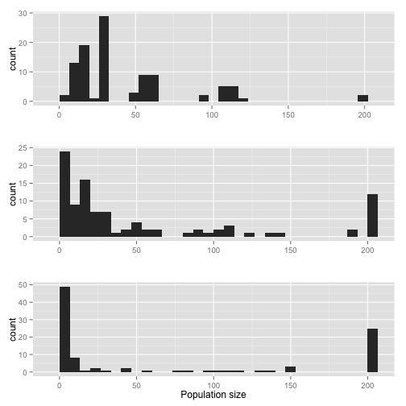
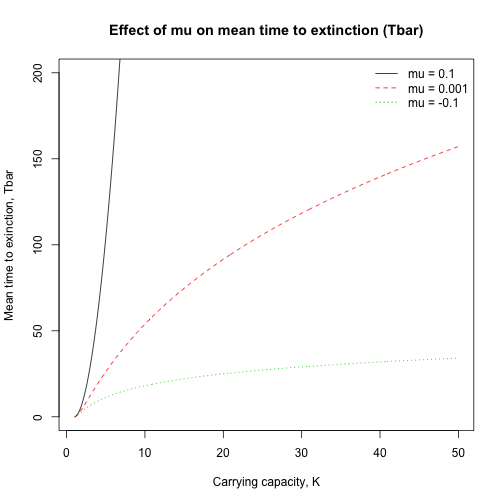
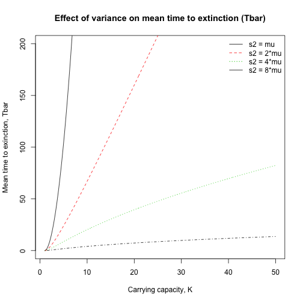
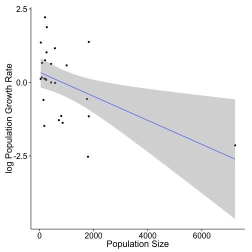

Ch.4 Count-Based PVA: Incorporating density dependence, demographic stochasticity, correlated environments, catastrophes, and bonanzas
========================================================

This chapter of Morris and Doaks demonstrates how to add biologically relevant details to PVA when the data are available. For example, negative density dependence is a common biological phenomenon. One way to model this is with the *theta logistic model*. 

The parameter *theta* determines how the population growth rate declines as population size increases. Although phenomenological, the advantage of the theta logistic model is its ability to describe several different patterns of negative density dependence.


```r
library(primer)
```

```
## Loading required package: deSolve
## Loading required package: lattice
```

```r
library(ggplot2)
source("~/Documents/miscellaneous_R/ggplot_themes.R")
source("~/Documents/miscellaneous_R/multiplot.R")

print(thetalogistic)
```

```
## function (times, y, parms) 
## {
##     n <- y[1]
##     with(as.list(parms), {
##         dN.dt <- r * n * (1 - (alpha * n)^theta)
##         return(list(c(dN.dt)))
##     })
## }
## <environment: namespace:primer>
```

```r

K = 100  # carrying capacity
r = 5  # r = log population growth rate at low density
alpha = 1/K  # alpha = inverse of carrying capacity. They use alpha instead of carrying capacity in 'thetalogistic' function for the primer package in R.

p.1 = c(r = r, alpha = alpha, theta = 0.3)
# theta = phenomological paramter
time = seq(1, 10, by = 0.01)
initialN = 1

Nt = ode(y = initialN, times = time, func = thetalogistic, parms = p.1)
Nt_sub = Nt[-length(time), ]
Nt1 = Nt[-1, -1]
theta_0.3 <- rep("theta_0.3", length(time) - 1)
theta_0.3_data <- cbind.data.frame(Nt_sub, Nt1, theta_0.3)
colnames(theta_0.3_data) <- c("time", "Nt", "Nt1", "theta")

# set 2
p.2 = c(r = r, alpha = alpha, theta = 1)
Nt_2 = ode(y = initialN, times = time, func = thetalogistic, parms = p.2)
Nt_sub_2 = Nt_2[-length(time), ]
Nt1_2 = Nt_2[-1, -1]
theta_1 <- rep("theta_1", length(time) - 1)
theta_1_data <- cbind.data.frame(Nt_sub_2, Nt1_2, theta_1)
colnames(theta_1_data) <- c("time", "Nt", "Nt1", "theta")

# set 3
p.3 = c(r = r, alpha = alpha, theta = 4)
Nt_3 = ode(y = initialN, times = time, func = thetalogistic, parms = p.3)
Nt_sub_3 = Nt_3[-length(time), ]
Nt1_3 = Nt_3[-1, -1]
theta_4 <- rep("theta_4", length(time) - 1)
theta_4_data <- cbind.data.frame(Nt_sub_3, Nt1_3, theta_4)
colnames(theta_4_data) <- c("time", "Nt", "Nt1", "theta")


thetalogistic_data <- rbind.data.frame(theta_0.3_data, theta_1_data, theta_4_data)
thetalogistic_data$Pop.growth.rate <- with(thetalogistic_data, log(Nt1/Nt))

# ggplot

pop_growth_rate_plot <- ggplot(data = thetalogistic_data, aes(x = Nt, y = Pop.growth.rate, 
    colour = theta)) + geom_line() + theme_axisL_legend + xlab("Population size, Nt") + 
    ylab("Population growth rate, log(Nt1/Nt)") + theme(legend.justification = c(1, 
    0), legend.position = c(1, 0.7)) + scale_color_manual(values = c("black", 
    "red", "blue"), name = "Theta values", labels = c(0.3, 1, 4))

pop_size_plot <- ggplot(data = thetalogistic_data, aes(x = time, y = Nt, colour = theta)) + 
    geom_line() + theme_axisL_legend + xlab("Time") + ylab("Population size") + 
    theme(legend.justification = c(1, 0), legend.position = c(1, 0)) + scale_color_manual(values = c("black", 
    "red", "blue"), name = "Theta values", labels = c(0.3, 1, 4))

multiplot(pop_size_plot, pop_growth_rate_plot, cols = 2)
```

 


Note that if *theta* is large, the population growth rate remains high until population size gets very close to K, at which point the growth rate drops off dramatically. Thus the theta logistic model approaches the ceiling model as *theta* approaches infinity.

Note also that the Ricker model, which is common in fisheries, is a special case of the theta logistic model obtained by setting *theta* equal to 1. Also, as carrying capacity goes to infinity (i.e., density dependence becomes weaker), this model reverts to the density-independent model.

Under the ceiling model, we can examine the mean time to extinction under particular parameter settings. Below is a graph of the mean time to extinction as a function of initial population sizes. Note that populations that are far from their carrying capacity go extinct relatively quickly compared to higher initial population sizes.


```r
# Plot mean time to extinction (N=1) vs. Nc for populations starting at
# various Nc <= K, according to equation 4.3

K = 200
Nc = seq(1, K, by = 1)
k = log(K)
d = log(Nc)
Tbar = (exp(2 * c * k) * (1 - exp(-2 * c * d)) - 2 * c * d)/(2 * mu * c)  # Eq 4.3
```

```
## Error: non-numeric argument to binary operator
```

```r

plot(Nc, Tbar, type = "l", xlab = "Initial population size, Nc", ylab = "Mean time to extinction, Tbar", 
    main = "Populations starting below K = 200")
```

```
## Error: object 'Tbar' not found
```


We can also look at how population growth rate alters mean time to extinction. Essentially, populations with positive mean growth rates will not go extinct for a **very** long time compared to those with negative growth rates (under the ceiling model). Also, note how negative mean population growth rates have a slower-than-linear relationship with increasing the ceiling, aka carrying capacity. In other words, simply increasing carrying capactiy of a population (e.g. increasing habitat size) is not that effective in preserving a population that has negative mean growth rates.


```r
# R code to plot the mean time to extinction for the ceiling model as
# functions of the carrying capacity and at three different population
# growth rates

mu1 = 0.1  # positive population growth rate
mu2 = 0.001  # barely positive population growth rate. Note that if mu = 0, then there is no feasible solution to the Tbar equation.
mu3 = -0.1  # negative population growth rate
s2 = 0.1  # variance of log population growth rate
c1 = mu1/s2
c2 = mu2/s2
c3 = mu3/s2

# Plot mean time to extinction (N=1) vs. K for populations starting at K,
# according to equation 4.4
K = seq(1, 50, by = 0.1)
k = log(K)

Tbar1 = (K^(2 * c1) - 1 - 2 * c1 * k)/(2 * mu1 * c1)  # Eq. 4.4
Tbar2 = (K^(2 * c2) - 1 - 2 * c2 * k)/(2 * mu2 * c2)
Tbar3 = (K^(2 * c3) - 1 - 2 * c3 * k)/(2 * mu3 * c3)

K_Tbar_matrix <- cbind(K, Tbar1, Tbar2, Tbar3)

matplot(K_Tbar_matrix[, 1], K_Tbar_matrix[, 2:4], type = "l", col = 1:3, ylim = c(0, 
    200), main = "Effect of mu on mean time to extinction (Tbar)", ylab = "Mean time to exinction, Tbar", 
    xlab = "Carrying capacity, K")
legend("topright", legend = c("mu = 0.1", "mu = 0.001", "mu = -0.1"), lty = 1:3, 
    col = 1:3, bty = "n")
```

 


We can also investigate how variance in population growth rates influences mean time to extinction. Even at mean positive growth rates, increasing the variance decreases the mean time to extinction.


```r
# R code to plot the mean time to extinction for the ceiling model as
# functions of the carrying capacity and at four different growth rate
# variances

mu = 0.1  # positive population growth rate
s2_1 = mu  # variance of log population growth rate
s2_2 = 2 * mu
s2_3 = 4 * mu
s2_4 = 8 * mu
c1 = mu/s2_1
c2 = mu/s2_2
c3 = mu/s2_3
c4 = mu/s2_4

# Plot mean time to extinction (N=1) vs. K for populations starting at K,
# according to equation 4.4
K = seq(1, 50, by = 0.1)
k = log(K)

Tbar1 = (K^(2 * c1) - 1 - 2 * c1 * k)/(2 * mu * c1)  # Eq. 4.4
Tbar2 = (K^(2 * c2) - 1 - 2 * c2 * k)/(2 * mu * c2)
Tbar3 = (K^(2 * c3) - 1 - 2 * c3 * k)/(2 * mu * c3)
Tbar4 = (K^(2 * c4) - 1 - 2 * c4 * k)/(2 * mu * c3)

K_Tbar_matrix <- cbind(K, Tbar1, Tbar2, Tbar3, Tbar4)

matplot(K_Tbar_matrix[, 1], K_Tbar_matrix[, 2:5], type = "l", col = 1:3, ylim = c(0, 
    200), main = "Effect of variance on mean time to extinction (Tbar)", ylab = "Mean time to exinction, Tbar", 
    xlab = "Carrying capacity, K")
legend("topright", legend = c("s2 = mu", "s2 = 2*mu", "s2 = 4*mu", "s2 = 8*mu"), 
    lty = 1:4, col = 1:4, bty = "n")
```

 


Now we are going to go through an exercise where we develop a PVA for a population with negative density dependence. To do this, we are going to make use of data available on two different populations of the Bay Checkerspot Butterfly


```r
library(AICcmodavg)  # functions for calculated corrected AIC with relatively low samples size

### JRC data
year_t <- seq(1960, 1986, by = 1)
Nt <- c(90, 175, 40, 45, 175, 200, 425, 425, 800, 256, 713, 198, 1819, 575, 
    567, 1819, 7227, 852, 216, 244, 267, 1753, 999, 1788, 143, 79, 94)
log_pop_growth <- c(0.665, -1.4759, 0.1178, 1.3581, 0.1335, 0.7538, 0, 0.6325, 
    -1.1394, 1.0243, -1.2812, 2.2178, -1.1517, -0.014, 1.1657, 1.3795, -2.138, 
    -1.3723, 0.1219, 0.0901, 1.8818, -0.5623, 0.5821, -2.526, -0.5934, 0.1738, 
    NA)  # log(Nt+1/Nt), response variable in the model
JRC_data <- cbind.data.frame(year_t, Nt, log_pop_growth)

### Visual check for negative density-dependence
ggplot(data = JRC_data, aes(x = Nt, y = log_pop_growth)) + geom_point() + stat_smooth(method = lm) + 
    theme_axisL_legend + ylab("log Population Growth Rate") + xlab("Population Size")
```

```
## Warning: Removed 1 rows containing missing values (stat_smooth).
## Warning: Removed 1 rows containing missing values (geom_point).
```

 

```r

### compare fit of 3 different models log_pop_growth ~ r : density independent
### model (K goes to infinity in theta-logistic model) log_pop_growth ~
### r*(1-Nt/K) : Ricker model (theta = 1 for theta-logistic model)
### log_pop_growth ~ r*(1-(Nt/K)^theta) : theta-logistic model log_pop_growth
### ~ r*-B*Nt*log(Nt/(A+Nt)) : allee effect model. 'B' determines the strength
### of negative density dependence.

### fit nonlinear least squares models
independ <- nls(log_pop_growth ~ r, data = JRC_data, start = list(r = 0.5))
summary(independ)
```

```
## 
## Formula: log_pop_growth ~ r
## 
## Parameters:
##   Estimate Std. Error t value Pr(>|t|)
## r  0.00167    0.23663    0.01     0.99
## 
## Residual standard error: 1.21 on 25 degrees of freedom
## 
## Number of iterations to convergence: 1 
## Achieved convergence tolerance: 3.68e-17
##   (1 observation deleted due to missingness)
```

```r
logLik(independ)  # calculate maximum log likelihood estimate
```

```
## 'log Lik.' -41.27 (df=2)
```

```r

ricker <- nls(log_pop_growth ~ r * (1 - Nt/K), data = JRC_data, start = list(r = 0.5, 
    K = 400))
summary(ricker)
```

```
## 
## Formula: log_pop_growth ~ r * (1 - Nt/K)
## 
## Parameters:
##   Estimate Std. Error t value Pr(>|t|)
## r    0.346      0.247    1.40     0.17
## K  846.016    517.098    1.64     0.11
## 
## Residual standard error: 1.08 on 24 degrees of freedom
## 
## Number of iterations to convergence: 5 
## Achieved convergence tolerance: 4.16e-08
##   (1 observation deleted due to missingness)
```

```r
logLik(ricker)
```

```
## 'log Lik.' -37.8 (df=3)
```

```r

theta_logistic <- nls(log_pop_growth ~ r * (1 - (Nt/K)^theta), data = JRC_data, 
    start = list(r = 0.5, K = 400, theta = 0.2))
summary(theta_logistic)
```

```
## 
## Formula: log_pop_growth ~ r * (1 - (Nt/K)^theta)
## 
## Parameters:
##       Estimate Std. Error t value Pr(>|t|)  
## r        0.994      1.154    0.86    0.398  
## K      551.371    317.903    1.73    0.096 .
## theta    0.457      0.433    1.05    0.303  
## ---
## Signif. codes:  0 '***' 0.001 '**' 0.01 '*' 0.05 '.' 0.1 ' ' 1
## 
## Residual standard error: 1.07 on 23 degrees of freedom
## 
## Number of iterations to convergence: 7 
## Achieved convergence tolerance: 8.72e-06
##   (1 observation deleted due to missingness)
```

```r
logLik(theta_logistic)
```

```
## 'log Lik.' -37.1 (df=4)
```

```r

# allee <- nls(log_pop_growth ~ r*-B*Nt*log(Nt/(A+Nt)), data = JRC_data,
# start = list(r = 0.5, B = 0.1, A = 10)) # not working, but apparently the
# maximum likelihood estimate for A should end up being zero, which
# interestingly reduces the equation down to the Ricker model (B = r/K).

# Calculate AICc for different models. nobs in AICc function is NOT
# EFFECTIVE at picking up the number of observations in the model. so it
# needs to be specified
AICc(independ, nobs = 26)
```

```
## [1] 87.05
```

```r
AICc(ricker, nobs = 26)
```

```
## [1] 82.69
```

```r
AICc(theta_logistic, nobs = 26)
```

```
## [1] 84.11
```

```r

# compare weights of models
AICc_values <- c(AICc(independ, nobs = 26), AICc(ricker, nobs = 26), AICc(theta_logistic, 
    nobs = 26))
delta <- AICc_values - min(AICc_values)  # AIC differences
L <- exp(-0.5 * delta)  # likelihood of models
w <- L/sum(L)  # suggests that Ricker model (second value) is twice as likely as the theta_logistic model. Although if we wanted a 95% confidence set of the best models, we would need to add them all up until the sum is >= 0.95
```


At this point, it seems like the Ricker model provides the best fit while maintaining the fewest number of parameters. Now we need to make some projections based off this model into the future.


```r
##### This program calculates by simulation the probability that a population
##### following the theta logistic model and starting at Nc will fall below the
##### extinction threshold Nx by time tmax

### Simulation parameters. Based off the Ricker model
r = 0.3458  # intrinsic rate of increase
K = 846.0162  # carrying capacity
theta = 1  # nonlinearity in density dependence. takes a value of 1 for Ricker model

sigma2 = var(residuals(ricker))  # environmental variance. Note that the 'var' function in R, uses (n-1) in the denominator so it gives an unbiased estimate of the residual variance.
sigma = sqrt(sigma2)  # multiplying 'sigma' by computer generated random values with a mean of zero and variance of one, will enable us to generate environmental variance that consists of normally distributed random numbers with a mean of zero and a variance of sigma2.

start_pop_size = 94  # last estimated population size
Nx = 20  # quasi-extinction threshold
tmax = 20  # time horizon in years
numreps = 50000  # numer of replicate population trajectories


### Simulation
pop_sizes_simulation <- matrix(data = c(rep(x = start_pop_size, times = numreps), 
    rep(x = 0, times = numreps * (tmax - 1))), ncol = numreps, byrow = TRUE)

for (i in 1:numreps) {
    for (j in 1:(tmax - 1)) {
        pop_sizes_simulation[j + 1, i] <- pop_sizes_simulation[j, i] * exp(r * 
            (1 - (pop_sizes_simulation[j, i]/K)^theta) + sigma * rnorm(1, mean = 0, 
            sd = 1))
    }
}

# identify which populations based below quasi extinction threshold during
# simulation
min_pop_sizes <- vector()
for (i in 1:numreps) {
    min_pop_sizes[i] <- min(pop_sizes_simulation[, i])
}

# calculate the cumulative probability of quasi-extinction over the length
# of tmax
table_extant <- table(ifelse(min_pop_sizes < Nx, "Extinct", "Extant"))
table_extant[2]/numreps  # takes the number of 'quasi-extinct' populations and divides it by the number of simulation reps to quantify the cumulative probability.
```

```
## Extinct 
##  0.4179
```

```r

```


The effect of environmental autocorrelation depends on the whether the model incorporates density dependence as well as the "shape" of density dependence near the equilibrium. Below, I go through an exercise to detect environmental autocorrelation while incorporating density-dependent effects. This will make use of the same JRC population data set.


```r
# Outline of necessary steps, some of which have already been done above.

# 1. Calculate observed log population growth rates

# 2. Use AICc to evaluate fit of density-independent and density-dependent
# models

# 3. Using best model, calculate predicted log population growth rate for
# each inter-census interval
predict(ricker)
```

```
##  [1]  0.309024  0.274280  0.329461  0.327418  0.274280  0.264061  0.172091
##  [8]  0.172091  0.018809  0.241171  0.054371  0.264878 -0.397710  0.110779
## [15]  0.114049 -0.397710 -2.608244 -0.002446  0.257521  0.246076  0.236674
## [22] -0.370732 -0.062533 -0.385038  0.287360  0.313520
```

```r

# 4. Subtract the predicted log growth rates from the observed log growth
# rates. Note that if the best model is density independent, then these are
# simply the differences between each observed log growth rate and mu.  5.
# Make 2 columns, the first containing the deviations for time intervals 1
# through q-1, and the second containing deviations from intervals 2 through
# q (q = number of estimates of population growth rate). Finally, calculate
# the Pearson correlation coefficient between the environmental deviations
# in successive years; this coefficient estimates the strength of
# 'first-order' environmental autocorrelation (i.e., the correlation between
# adjacent years)

interval_1_q1 <- predict(ricker)[-26] - log_pop_growth[-c(26, 27)]  # removes last 'NA' value in observed log growth rates as well as the 'q - 1' value. Also calculates deviations from time intervals 1 through q - 1, where q is the number of estimates of population growth rate
interval_2_q <- predict(ricker)[-1] - log_pop_growth[-c(1, 27)]  # calculates differences from second time interval to the last observed value

cor.test(interval_1_q1, interval_2_q)  # since the correlation does not signficantly deviate from zero, we are justified in not included temporal environmental autocorrelation in our analysis.
```

```
## 
## 	Pearson's product-moment correlation
## 
## data:  interval_1_q1 and interval_2_q
## t = -0.9222, df = 23, p-value = 0.366
## alternative hypothesis: true correlation is not equal to 0
## 95 percent confidence interval:
##  -0.5434  0.2229
## sample estimates:
##     cor 
## -0.1888
```

