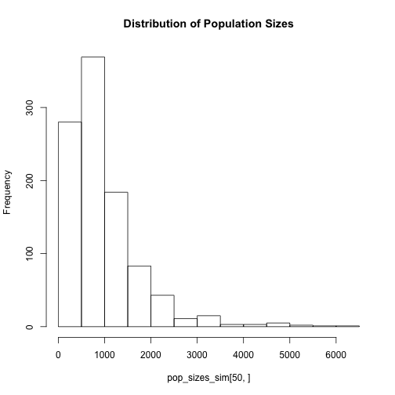

Ch.4 Count-Based PVA: Incorporating density dependence, demographic stochasticity, correlated environments, catastrophes, and bonanzas
========================================================

This chapter of Morris and Doaks demonstrates how to add biologically relevant details to PVA when the data are available. For example, negative density dependence is a common biological phenomenon. One way to model this is with the *theta logistic model*. 

The parameter *theta* determines how the population growth rate declines as population size increases. Although phenomenological, the advantage of the theta logistic model is its ability to describe several different patterns of negative density dependence.


```r
library(primer)
```

```
## Loading required package: deSolve
## Loading required package: lattice
```

```r
library(ggplot2)
source("~/Documents/miscellaneous_R/ggplot_themes.R")
source("~/Documents/miscellaneous_R/multiplot.R")

print(thetalogistic)
```

```
## function (times, y, parms) 
## {
##     n <- y[1]
##     with(as.list(parms), {
##         dN.dt <- r * n * (1 - (alpha * n)^theta)
##         return(list(c(dN.dt)))
##     })
## }
## <environment: namespace:primer>
```

```r

K = 100  # carrying capacity
r = 5  # r = log population growth rate at low density
alpha = 1/K  # alpha = inverse of carrying capacity. They use alpha instead of carrying capacity in 'thetalogistic' function for the primer package in R.

p.1 = c(r = r, alpha = alpha, theta = 0.3)
# theta = phenomological paramter
time = seq(1, 10, by = 0.01)
initialN = 1

Nt = ode(y = initialN, times = time, func = thetalogistic, parms = p.1)
Nt_sub = Nt[-length(time), ]
Nt1 = Nt[-1, -1]
theta_0.3 <- rep("theta_0.3", length(time) - 1)
theta_0.3_data <- cbind.data.frame(Nt_sub, Nt1, theta_0.3)
colnames(theta_0.3_data) <- c("time", "Nt", "Nt1", "theta")

# set 2
p.2 = c(r = r, alpha = alpha, theta = 1)
Nt_2 = ode(y = initialN, times = time, func = thetalogistic, parms = p.2)
Nt_sub_2 = Nt_2[-length(time), ]
Nt1_2 = Nt_2[-1, -1]
theta_1 <- rep("theta_1", length(time) - 1)
theta_1_data <- cbind.data.frame(Nt_sub_2, Nt1_2, theta_1)
colnames(theta_1_data) <- c("time", "Nt", "Nt1", "theta")

# set 3
p.3 = c(r = r, alpha = alpha, theta = 4)
Nt_3 = ode(y = initialN, times = time, func = thetalogistic, parms = p.3)
Nt_sub_3 = Nt_3[-length(time), ]
Nt1_3 = Nt_3[-1, -1]
theta_4 <- rep("theta_4", length(time) - 1)
theta_4_data <- cbind.data.frame(Nt_sub_3, Nt1_3, theta_4)
colnames(theta_4_data) <- c("time", "Nt", "Nt1", "theta")


thetalogistic_data <- rbind.data.frame(theta_0.3_data, theta_1_data, theta_4_data)
thetalogistic_data$Pop.growth.rate <- with(thetalogistic_data, log(Nt1/Nt))

# ggplot

pop_growth_rate_plot <- ggplot(data = thetalogistic_data, aes(x = Nt, y = Pop.growth.rate, 
    colour = theta)) + geom_line() + theme_axisL_legend + xlab("Population size, Nt") + 
    ylab("Population growth rate, log(Nt1/Nt)") + theme(legend.justification = c(1, 
    0), legend.position = c(1, 0.7)) + scale_color_manual(values = c("black", 
    "red", "blue"), name = "Theta values", labels = c(0.3, 1, 4))

pop_size_plot <- ggplot(data = thetalogistic_data, aes(x = time, y = Nt, colour = theta)) + 
    geom_line() + theme_axisL_legend + xlab("Time") + ylab("Population size") + 
    theme(legend.justification = c(1, 0), legend.position = c(1, 0)) + scale_color_manual(values = c("black", 
    "red", "blue"), name = "Theta values", labels = c(0.3, 1, 4))

multiplot(pop_size_plot, pop_growth_rate_plot, cols = 2)
```

 


Note that if *theta* is large, the population growth rate remains high until population size gets very close to K, at which point the growth rate drops off dramatically. Thus the theta logistic model approaches the ceiling model as *theta* approaches infinity.

Note also that the Ricker model, which is common in fisheries, is a special case of the theta logistic model obtained by setting *theta* equal to 1. Also, as carrying capacity goes to infinity (i.e., density dependence becomes weaker), this model reverts to the density-independent model.


```r
# R code to plot the mean time to extinction for the ceiling model as
# functions of the carrying capacity and initial population size

mu = 0.1  # mean log population growth rate
s2 = 0.1  # variance of log population growth rate
c = mu/s2

# Plot mean time to extinction (N=1) vs. K for populations starting at K,
# according to equation 4.4
K = seq(1, 50, by = 0.1)
k = log(K)

Tbar = (K^(2 * c) - 1 - 2 * c * k)/(2 * mu * c)  # Eq. 4.4

plot(K, Tbar, type = "l", xlab = "Carrying Capacity, K", ylab = "Mean time to extinction, Tbar", 
    main = "Populations starting at K")
```

 

```r


# Plot mean time to extinction (N=1) vs. Nc for populations starting at
# various Nc <= K, according to equation 4.3

K = 200
Nc = seq(1, K, by = 1)
k = log(K)
d = log(Nc)
Tbar = (exp(2 * c * k) * (1 - exp(-2 * c * d)) - 2 * c * d)/(2 * mu * c)  # Eq 4.3

plot(Nc, Tbar, type = "l", xlab = "Initial population size, Nc", ylab = "Mean time to extinction, Tbar", 
    main = "Populations starting below K = 200")
```

 


We can also look at how population growth rate alters mean time to extinction. Essentially, populations with positive mean growth rates will not go extinct for a **very** long time compared to those with negative growth rates (under the ceiling model). 


```r
# R code to plot the mean time to extinction for the ceiling model as
# functions of the carrying capacity and at three different population
# growth rates

mu1 = 0.1  # positive population growth rate
mu2 = 0.001  # barely positive population growth rate. Note that if mu = 0, then there is no feasible solution to the Tbar equation.
mu3 = -0.1  # negative population growth rate
s2 = 0.1  # variance of log population growth rate
c1 = mu1/s2
c2 = mu2/s2
c3 = mu3/s2

# Plot mean time to extinction (N=1) vs. K for populations starting at K,
# according to equation 4.4
K = seq(1, 50, by = 0.1)
k = log(K)

Tbar1 = (K^(2 * c1) - 1 - 2 * c1 * k)/(2 * mu1 * c1)  # Eq. 4.4
Tbar2 = (K^(2 * c2) - 1 - 2 * c2 * k)/(2 * mu2 * c2)
Tbar3 = (K^(2 * c3) - 1 - 2 * c3 * k)/(2 * mu3 * c3)

K_Tbar_matrix <- cbind(K, Tbar1, Tbar2, Tbar3)

matplot(K_Tbar_matrix[, 1], K_Tbar_matrix[, 2:4], type = "l", col = 1:3, ylim = c(0, 
    200), main = "Effect of mu on mean time to extinction (Tbar)", ylab = "Mean time to exinction, Tbar", 
    xlab = "Carrying capacity, K")
legend("topright", legend = c("mu = 0.1", "mu = 0.001", "mu = -0.1"), lty = 1:3, 
    col = 1:3, bty = "n")
```

 


We can also investigate how variance in population growth rates influences mean time to extinction. Even at mean positive growth rates, increasing the variance decreases the mean time to extinction.


```r
# R code to plot the mean time to extinction for the ceiling model as
# functions of the carrying capacity and at four different growth rate
# variances

mu = 0.1  # positive population growth rate
s2_1 = mu  # variance of log population growth rate
s2_2 = 2 * mu
s2_3 = 4 * mu
s2_4 = 8 * mu
c1 = mu/s2_1
c2 = mu/s2_2
c3 = mu/s2_3
c4 = mu/s2_4

# Plot mean time to extinction (N=1) vs. K for populations starting at K,
# according to equation 4.4
K = seq(1, 50, by = 0.1)
k = log(K)

Tbar1 = (K^(2 * c1) - 1 - 2 * c1 * k)/(2 * mu * c1)  # Eq. 4.4
Tbar2 = (K^(2 * c2) - 1 - 2 * c2 * k)/(2 * mu * c2)
Tbar3 = (K^(2 * c3) - 1 - 2 * c3 * k)/(2 * mu * c3)
Tbar4 = (K^(2 * c4) - 1 - 2 * c4 * k)/(2 * mu * c3)

K_Tbar_matrix <- cbind(K, Tbar1, Tbar2, Tbar3, Tbar4)

matplot(K_Tbar_matrix[, 1], K_Tbar_matrix[, 2:5], type = "l", col = 1:3, ylim = c(0, 
    200), main = "Effect of variance on mean time to extinction (Tbar)", ylab = "Mean time to exinction, Tbar", 
    xlab = "Carrying capacity, K")
legend("topright", legend = c("s2 = mu", "s2 = 2*mu", "s2 = 4*mu", "s2 = 8*mu"), 
    lty = 1:3, col = 1:3, bty = "n")
```

 

