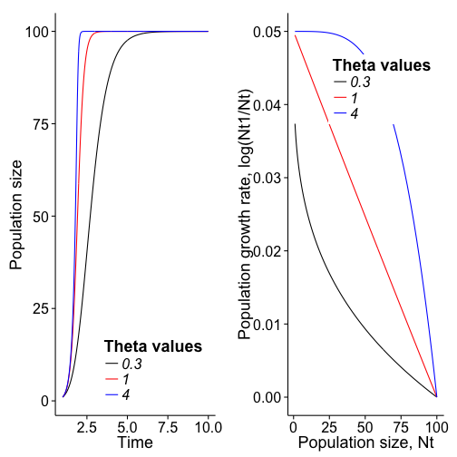
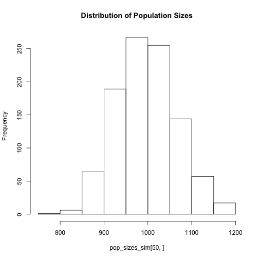

Importance of modelling variance in population growth rates in accurately predicting future population size.
========================================================

This code is based of Morris & Doak's MATLAB code (CITATION, pg. 29-30).  This code simulation discrete exponential growth trajectories with a set of observed population growth rates (lambda values).


```r
library(ggplot2)
########## Simulation Parameters
lambdas <- c(1, 1.98, 1.02, 0.92, 0.53)  # different lambda values to use for simulation.  There can be as many as you want.  For this simulation, each will be drawn with an equal probability.

start_pop_size <- 29  # starting population size
tmax <- 100  # length of simulations
numreps <- 100  # number of replicate trajectories to simulate

# setup the simulation matrix to have lambda values chosen from
simulated_lambdas_matrix <- matrix(data = 0, ncol = numreps, nrow = tmax - 1)
for (i in 1:numreps) {
    simulated_lambdas_matrix[, i] <- sample(x = lambdas, size = (tmax - 1), 
        replace = TRUE)
}

# setup population size matrix to have values inserted into
pop_sizes_simulation <- matrix(data = c(rep(x = start_pop_size, times = numreps), 
    rep(x = 0, times = numreps * (tmax - 1))), ncol = numreps, byrow = TRUE)

# conduct simulation
for (i in 1:numreps) {
    for (j in 1:(tmax - 1)) {
        pop_sizes_simulation[j + 1, i] <- simulated_lambdas_matrix[j, i] * pop_sizes_simulation[j, 
            i]
    }
}

pop_sizes_simulation[pop_sizes_simulation < 1] <- 0  # identified all instances where population size dipped below 1 individual and labeled it as extinct. 

# Plots distribution of population sizes after 5 years in the simulation
min_pop_size_each_rep_year5 <- vector()
for (i in 1:numreps) {
    min_pop_size_each_rep_year5[i] <- min(pop_sizes_simulation[1:5, i])
}
pop_sizes_simulation[5, ][min_pop_size_each_rep_year5 == 0] <- 0  # labels any population that dipped to the extinction threshold as having gone extinct
pop_sizes_simulation[5, ][pop_sizes_simulation[5, ] > 200] <- 200  # replaces largest values with a value of 200
year_5_pop_sizes <- as.data.frame(pop_sizes_simulation[5, ])
year_5_hist <- ggplot(year_5_pop_sizes, aes(x = pop_sizes_simulation[5, ])) + 
    geom_histogram() + xlab("")  # creates the histogram

# Plots the distribution of population sizes after 20 years in the
# simulation
min_pop_size_each_rep_year20 <- vector()
for (i in 1:numreps) {
    min_pop_size_each_rep_year20[i] <- min(pop_sizes_simulation[1:20, i])
}
pop_sizes_simulation[20, ][min_pop_size_each_rep_year20 == 0] <- 0
pop_sizes_simulation[20, ][pop_sizes_simulation[20, ] > 200] <- 200
year_20_pop_sizes <- as.data.frame(pop_sizes_simulation[20, ])
year_20_hist <- ggplot(year_20_pop_sizes, aes(x = pop_sizes_simulation[20, ])) + 
    geom_histogram() + xlab("")

# Plots the distribution of population sizes after 100 years in the
# simulation
min_pop_size_each_rep_year100 <- vector()
for (i in 1:numreps) {
    min_pop_size_each_rep_year100[i] <- min(pop_sizes_simulation[1:100, i])
}
pop_sizes_simulation[100, ][min_pop_size_each_rep_year100 == 0] <- 0
pop_sizes_simulation[100, ][pop_sizes_simulation[100, ] > 200] <- 200
year_100_pop_sizes <- as.data.frame(pop_sizes_simulation[100, ])
year_100_hist <- ggplot(year_100_pop_sizes, aes(x = pop_sizes_simulation[100, 
    ])) + geom_histogram() + xlab("Population size")

source("~/Documents/miscellaneous_R/multiplot.R")
multiplot(year_5_hist, year_20_hist, year_100_hist, cols = 1)
```

```
## Loading required package: grid
## stat_bin: binwidth defaulted to range/30. Use 'binwidth = x' to adjust this.
## stat_bin: binwidth defaulted to range/30. Use 'binwidth = x' to adjust this.
## stat_bin: binwidth defaulted to range/30. Use 'binwidth = x' to adjust this.
```

 

```r

# Geometric mean
mean_geom <- lambdas[1]^0.2 * lambdas[2]^0.2 * lambdas[3]^0.2 * lambdas[4]^0.2 * 
    lambdas[5]^0.2  # predicts an almost stable population (lambda = 1)
```


The main thing to take away from this is that the variance in population size always increases over time. Also, the estimated population sizes diverge in that many are going extinct, but there are also many that have hugh population sizes.

Now I want to examine how variance in population growth rate influences the population viability. As you increase the variance in population growth rate, the cumulative probability of extinction always increases. This even happens if the average lambda value is greater than one.


```r
count_PVA_lambda_variance_simulation <- function(mean_lambda, sd_lambda, start_size = 1000, 
    tiempo = 50, reps = 1000) {
    sim_lambdas_matrix <- matrix(data = rnorm(n = reps * (tiempo - 1), mean = mean_lambda, 
        sd = sd_lambda), ncol = reps, nrow = tiempo - 1)  # creates a matrix of lambda values based on randomly selected values (specified by function parameters) from a normal distribution
    
    pop_sizes_sim <- matrix(data = c(rep(x = start_size, times = reps), rep(x = 0, 
        times = reps * (tiempo - 1))), ncol = reps, byrow = TRUE)
    
    for (i in 1:reps) {
        for (j in 1:(tiempo - 1)) {
            pop_sizes_sim[j + 1, i] <- sim_lambdas_matrix[j, i] * pop_sizes_sim[j, 
                i]
        }
    }
    
    min_pop_size_each_rep_year50 <- vector()
    for (i in 1:reps) {
        min_pop_size_each_rep_year50[i] <- min(pop_sizes_sim[1:50, i])
    }
    pop_sizes_sim[50, ][min_pop_size_each_rep_year50 < 1] <- 0
    # pop_sizes_sim[50, ][pop_sizes_sim[50, ] < 1] <- 0
    pop_sizes_sim[50, ][pop_sizes_sim[50, ] > 10000] <- 10000
    
    hist(pop_sizes_sim[50, ], main = "Distribution of Population Sizes")
    pops_extinct <- table(ifelse(pop_sizes_sim[50, ] == 0, "Extinct", "Extant"))
    cum_prob_extinct <- pops_extinct[2]/reps  # cumulative probability of extinction
    names(cum_prob_extinct) <- "Cumulative probability of Extinction"
    print(cum_prob_extinct)
}

count_PVA_lambda_variance_simulation(mean_lambda = 1, sd_lambda = 0.01)
```

 

```
## Cumulative probability of Extinction 
##                                   NA
```

```r
count_PVA_lambda_variance_simulation(mean_lambda = 1, sd_lambda = 0.1)
```

 

```
## Cumulative probability of Extinction 
##                                   NA
```

```r
count_PVA_lambda_variance_simulation(mean_lambda = 1, sd_lambda = 1)
```

 

```
## Cumulative probability of Extinction 
##                                   NA
```


